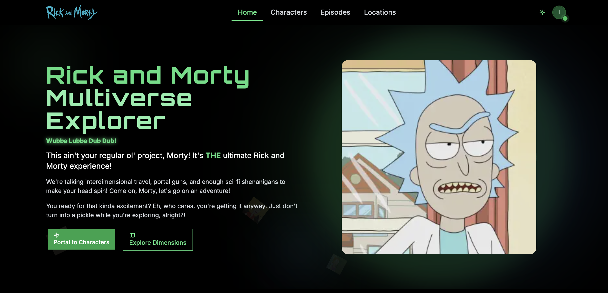

# Rick and Morty Explorer 🚀

A modern web application that lets you explore the Rick and Morty universe through an interactive and visually appealing interface. Built with Next.js and the official Rick and Morty API.



## 🔗 Demo

Check out the live demo at: [Rick and Morty Explorer](https://rick-and-morty-ivory-phi.vercel.app)

## 🌟 Features

- **Character Explorer**: Browse through all Rick and Morty characters with detailed information
- **Episode Guide**: Access comprehensive episode information and details
- **Location Database**: Explore various locations from the Rick and Morty universe
- **Search & Filter**: Find specific characters, episodes, or locations with advanced filtering
- **Responsive Design**: Fully responsive interface that works on all devices
- **Modern UI**: Built with Tailwind CSS and Radix UI components
- **Type Safety**: Written in TypeScript for better development experience
- **Authentication**: User authentication system for personalized experience

## 🛠️ Tech Stack

- **Framework**: Next.js 15 with App Router
- **Styling**: Tailwind CSS
- **UI Components**: Radix UI
- **Animations**: Framer Motion
- **Authentication**: NextAuth.js
- **Database**: Prisma with Neon
- **Type Safety**: TypeScript

## 🚀 Getting Started

### Prerequisites

- Node.js 18.x or later
- npm or yarn package manager
- A database (Neon recommended)

### Installation

1. Clone the repository:
```bash
git clone https://github.com/igor-romasiuk/rick-and-morty.git
cd rick-and-morty
```

2. Install dependencies:
```bash
npm install
```

3. Set up environment variables:
```bash
cp .env.example .env.local
```
Edit `.env.local` with your database credentials and other required variables.

4. Run database migrations:
```bash
npx prisma migrate dev
```

5. Start the development server:
```bash
npm run dev
```

The application will be available at [http://localhost:3000](http://localhost:3000)

## 🙏 Acknowledgments

- [Rick and Morty API](https://rickandmortyapi.com/) for providing the data
